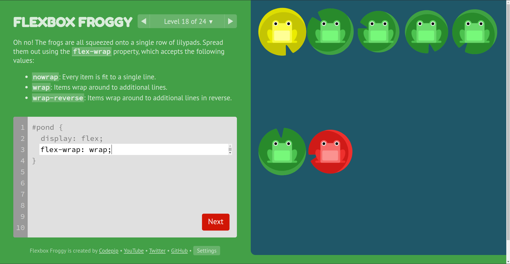
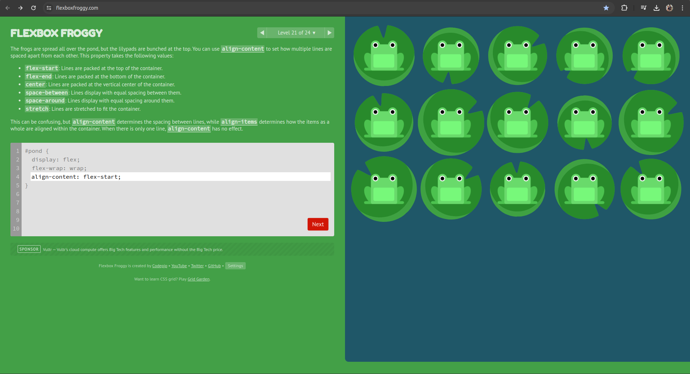

### Flex Box - Conceito

- Basicamente para utilizar as propriedades você precisa ter um container com display
flex;

#### justify-content

- Basicamente alinha itens horizontalmente e aceita os seguintes valores:
    - flex-start -> itens se alinham à esquerda do container;
    - flex-end -> itens se alinham à direita do container;
    - center -> itens se alinham no centro do container;
    - space-between -> itens se alinham com distância igual entre eles;
    - space-around -> itens se alinham com distância igual em torno deles.

#### align-items

- Basicamente alinha os itens verticalmente e aceita os seguintes valores:
    - flex-start: Itens se alinham na parte de cima do container;
    - flex-end: Itens se alinha na parte de baixo do container;
    - center: Itens se alinha no centro vertical do container;
    - baseline: Itens se alinham na linha base do container;
    - stretch: Itens se esticam para preencher o container.

#### flex-direction

- Basicamente define a direção em que os itens são posionados no container, aceitando
os seguintes valores:
    - row: itens são posicionados na mesma direção do texto;
    - row-reverse: itens são posicionados na direção oposta à do texto;
    - column: itens são posicionados de cima para baixo;
    - column-reverse: itens são posicionados de baixo para cima.
- Quando se usa column: o justify-content que alinha os itens na horizontal passa a alinhar os 
itens na vertical, e também o align-items que originalmente alinha na vertical os itens,
passa a alinhar na horizontal;

#### order

- quando não conseguimos usar alinha um item especifico com align-items ou justify-content,
temos que usar a prop order: passando um valor inteiro (negativo ou positivo) no elemeto que queremos
mudar a ordem.
    ```css
        .yellow {
            order: 1;
        }
    ```css

#### align-self

- Funciona igual o align-items porém para itens específicos.
    - align-self: flex-end;
        ```css
        
            #pond {
                display: flex;
                align-items: flex-start;
        }

        .yellow {
            align-self: flex-end;
        }```
    - Exemplo:
        

#### flex-wrap

- Basicamente o flex-wrap é usado quando queremos espalhar ou não os itens:
    - nowrap: todos itens são apertaos em uma única linha;
    - wrap: itens se separam em linhas adicionais;
    - wrap-reverse: itens se separam em linhas adicionais em reverso.
    - ```css
        #pond {
            display: flex;
            flex-wrap: wrap;
            }
        ```
    - 
    - ```css
        /*Usando flex-wrap para quebrar em várias colunas.*/
            #pond {
        display: flex;
        flex-direction: column;
        flex-wrap: wrap;
        }
        ```
    - 

#### flex-flow: column wrap

- Basicament é um atalho para utilizar o flex-direction com o flex-wrap.
    - sendo assim você passa o flex-direction e o flex-wrap
    - Exemplo: 
        ```css
            #pond {
        display: flex;
        flex-flow: column wrap; 
        /*
        flex-direction: column;
        flex-wrap: wrap;
         */
        }
        ```
    - 

#### align-content

- Basicamente ele funciona igual o align-items só que quando temos linhas ou colunas (dependendo do flex-direction: row ou column), ai ele ajusta o espaçamento entre essas linhas/colunas.
    - Exemplo:
        ```css
            #pond {
                display: flex;
                flex-wrap: wrap;
                align-content: flex-start;
            }
    - 

#### Ultimo desafio (LEVEL 24)

- Exemplo: 
    ```css
        #pond {
            display: flex;
            flex-flow: column-reverse wrap-reverse;
            justify-content: center;
            align-content: space-between;
        }
- Resultado: 
